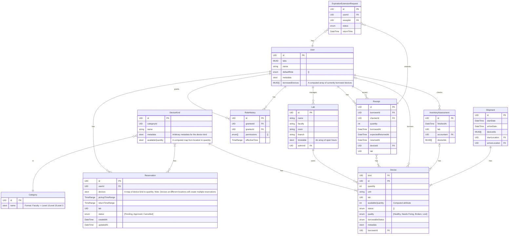

# Database design

## Draft design

### Gray areas 

These are to be determined later when the query pattern and the DBMS is known:

* Generic data types:
  * UID: A data type for representing a unique identifier
  * MUID: A data type for representing a unique identifier + metadata
  * stext (structured text): A data type for a semi-structure text field 
  * enum: A data type for enumerated fields
* A PK UID field exists only logically, physically, another group of key fields can be chosen to be the PK.
* Some denormalized fields are placed in `stext` fields, can be normalized later to other relations if that make sense.
* Handling of slowly changing dimensions (SCDs).

### Diagram

## Query pattern

## SCD handling